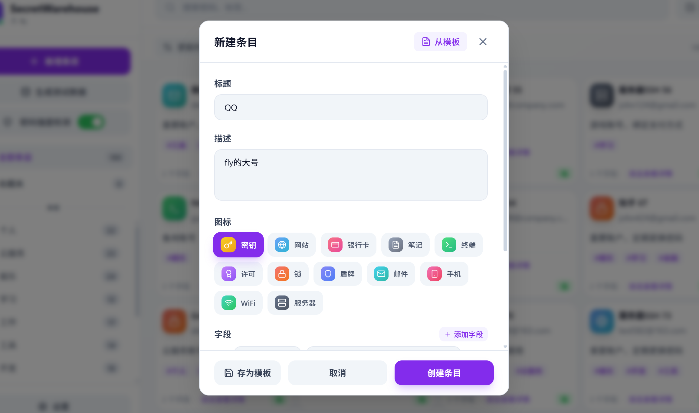

# SecretWarehouse

<div align="center">


**安全、高效的本地密码管理器**

基于 Tauri + React + TypeScript 构建的跨平台桌面密码管理应用

[](LICENSE)
[]()

</div>

---

## 📸 页面总览

### 主界面

<div align="center">


*主界面 - 左侧导航栏 + 右侧卡片列表*

</div>

### 新建/编辑条目

<div align="center">



*新建条目 - 支持自定义字段、标签、图标*

</div>

### 模板选择

<div align="center">


*模板选择 - 快速创建常见类型的密码条目*

</div>

### 条目详情

<div align="center">


*条目详情 - 查看和管理密码字段*

</div>

---

## ✨ 功能特性

### 🔐 核心功能

| 功能 | 说明 |
|------|------|
| **密码存储** | AES-256-GCM 加密存储所有敏感字段 |
| **条目管理** | 创建、编辑、删除、搜索密码条目 |
| **字段自定义** | 支持任意数量的自定义字段（用户名、密码、API密钥等） |
| **敏感字段遮蔽** | 手动设置字段为敏感状态，显示时自动遮蔽 |
| **标签分类** | 为条目添加多个标签，支持按标签筛选 |
| **收藏功能** | 标记重要条目为收藏，快速访问 |
| **批量操作** | 支持多选、全选、批量删除 |

### 📋 模板系统

| 功能 | 说明 |
|------|------|
| **预设模板** | 从模板快速创建常见类型的条目 |
| **自定义模板** | 将当前配置保存为模板，复用字段结构 |
| **模板管理** | 创建、编辑、删除模板 |

### 🎨 界面特性

| 功能 | 说明 |
|------|------|
| **深色模式** | 支持浅色/深色/跟随系统三种主题 |
| **响应式布局** | 自适应不同窗口大小 |
| **卡片视图** | 直观的卡片式展示 |
| **拖拽排序** | 字段支持拖拽交换顺序 |
| **平滑动画** | 丰富的交互动画效果 |

### 🔍 搜索功能

| 功能 | 说明 |
|------|------|
| **全文搜索** | 搜索标题、描述、标签、字段内容 |
| **实时搜索** | 输入即搜索，无需回车 |
| **标签筛选** | 点击标签快速筛选相关条目 |

---

## 🛠️ 技术栈

| 类别 | 技术 |
|------|------|
| **框架** | [Tauri](https://tauri.app/) v1.x |
| **前端** | React 18 + TypeScript |
| **状态管理** | Zustand |
| **样式** | Tailwind CSS |
| **图标** | Lucide React |
| **后端** | Rust |
| **数据库** | SQLite (rusqlite) |
| **加密** | AES-256-GCM (aes-gcm) |
| **构建工具** | Vite |

---

## 📦 环境配置

### 基础环境

在运行构建脚本之前，请确保已安装以下工具：

#### 1. Node.js (v18 或更高版本)

```bash
# 检查版本
node --version
npm --version
```

**Windows：**
前往 [Node.js 中文网](https://nodejs.org/zh-cn/download/) 下载 Windows 安装程序 (.msi)，直接安装即可。

**Linux/macOS：**
```bash
# 推荐使用 nvm
curl -o- https://raw.githubusercontent.com/nvm-sh/nvm/v0.39.0/install.sh | bash
nvm install 18
nvm use 18
```

#### 2. Rust 工具链

```bash
# 安装 rustup (所有平台)
curl --proto '=https' --tlsv1.2 -sSf https://sh.rustup.rs | sh

# 检查安装
rustc --version
cargo --version
```

#### 3. 平台特定依赖

**Linux (Ubuntu/Debian)：**
```bash
sudo apt install -y build-essential libssl-dev libgtk-3-dev libwebkit2gtk-4.0-dev
```

**Linux (Fedora)：**
```bash
sudo dnf install -y gcc gcc-c++ openssl-devel gtk3-devel webkit2gtk4.0-devel
```

**macOS：**
```bash
xcode-select --install
```

**Windows：**
安装 [Visual Studio Build Tools](https://visualstudio.microsoft.com/visual-cpp-build-tools/)，勾选 "C++ build tools"

---

## 🚀 快速开始

### 1. 克隆项目

```bash
git clone https://gitcode.com/roverfly/SecretWarehouse.git
cd SecretWarehouse/SecretWarehouse
```

### 2. 安装依赖

```bash
npm install
```

### 3. 开发模式运行

```bash
npm run tauri dev
```

### 4. 构建可执行文件

使用提供的构建脚本：

**Linux：**
```bash
./build_linux.sh
# 输出目录: linux_dist/
```

**macOS：**
```bash
./build_mac.sh
# 输出目录: mac_dist/
```

**Windows (PowerShell)：**
```powershell
.\build_windows.ps1
# 输出目录: windows_dist\
```

---

## 📁 项目结构

```
SecretWarehouse/
├── src/                          # 前端源代码
│   ├── components/               # React 组件
│   │   ├── SearchBar.tsx         # 搜索栏
│   │   ├── SecretCard.tsx        # 密码卡片
│   │   ├── SecretDetail.tsx      # 条目详情
│   │   ├── SecretForm.tsx        # 新建/编辑表单
│   │   ├── SecretList.tsx        # 卡片列表
│   │   ├── Sidebar.tsx           # 侧边栏导航
│   │   ├── TemplateForm.tsx      # 模板表单
│   │   └── TemplateList.tsx      # 模板列表
│   ├── stores/                   # 状态管理
│   │   └── useStore.ts           # Zustand store
│   ├── types/                    # TypeScript 类型定义
│   │   └── index.ts
│   ├── utils/                    # 工具函数
│   │   └── sensitive.ts          # 敏感字段处理
│   ├── App.tsx                   # 应用入口
│   └── index.css                 # 全局样式
├── src-tauri/                    # Rust 后端
│   ├── src/
│   │   ├── main.rs               # 应用入口
│   │   ├── commands.rs           # Tauri 命令
│   │   ├── crypto.rs             # 加密模块
│   │   ├── db.rs                 # 数据库操作
│   │   ├── models.rs             # 数据模型
│   │   └── search.rs             # 搜索功能
│   ├── Cargo.toml                # Rust 依赖
│   └── tauri.conf.json           # Tauri 配置
├── build_linux.sh                # Linux 构建脚本
├── build_mac.sh                  # macOS 构建脚本
├── build_windows.ps1             # Windows 构建脚本
├── package.json                  # Node.js 依赖
└── README.md                     # 项目说明
```

---

## 🔒 安全说明

### 加密机制

- **算法**: AES-256-GCM
- **密钥派生**: 开发模式使用固定密钥，生产模式计划使用 Argon2id
- **存储**: 所有敏感字段在存储前均进行加密

### 数据存储

- **位置**: 应用运行目录下的 `secret_warehouse.db`
- **格式**: SQLite 数据库
- **加密**: 字段内容使用 AES-256-GCM 加密后存储

### ⚠️ 注意事项

> 当前为开发版本，使用固定加密密钥。生产版本将实现主密码功能。

---

## 🖼️ 图片资源

请将以下截图放置到 `docs/images/` 目录：

| 文件名 | 说明 |
|--------|------|
| `logo.png` | 项目 Logo (建议 256x256) |
| `main.png` | 主界面截图 |
| `create-entry.png` | 新建条目界面 |
| `template-select.png` | 模板选择界面 |
| `entry-detail.png` | 条目详情界面 |

创建目录并添加图片：

```bash
mkdir -p docs/images
# 将截图复制到该目录
```

---

## 📝 开发计划

- [ ] 实现主密码功能
- [ ] 添加导入/导出功能 (JSON/CSV)
- [ ] 添加密码生成器 UI
- [ ] 实现自动锁定功能
- [ ] 添加密码强度检测
- [ ] 支持TOTP两步验证
- [ ] 添加云同步支持 (可选)
- [ ] 实现浏览器扩展集成

---

## 🤝 贡献

欢迎提交 Issue 和 Pull Request！

1. Fork 本仓库
2. 创建特性分支 (`git checkout -b feature/amazing-feature`)
3. 提交更改 (`git commit -m 'Add amazing feature'`)
4. 推送到分支 (`git push origin feature/amazing-feature`)
5. 创建 Pull Request

---

## 📄 许可证

本项目采用 MIT 许可证 - 查看 [LICENSE](LICENSE) 文件了解详情

---

## 🙏 致谢

- [Tauri](https://tauri.app/) - 构建跨平台桌面应用的框架
- [React](https://react.dev/) - 用户界面库
- [Tailwind CSS](https://tailwindcss.com/) - CSS 框架
- [Lucide](https://lucide.dev/) - 图标库
- [Zustand](https://github.com/pmndrs/zustand) - 状态管理

---

<div align="center">

**如果这个项目对你有帮助，请给个 Star ⭐**

</div>
